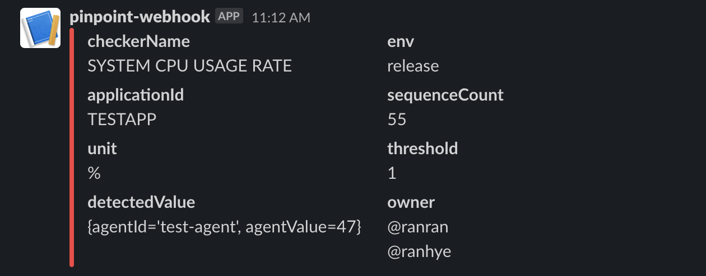

# slack-receiver
This is example project for pinpoint alarm webhook functionality.  
You can reuse this server to use sending slack message to your own channel.  
[pinpoint webhook documentation](https://pinpoint-apm.github.io/pinpoint/alarm.html)

## requirements
- Java 1.8
- Spring Boot

## how to run
If you don't have any webhook incoming url yet, please refer to this documentation.  
[slack incoming webhook integration](https://api.slack.com/messaging/webhooks)
1. in application.properties  
slack.incoming.webhook.url={SLACK_INCOMING_WEBHOOK_URL}
2. ./mvnw package  
3. java -jar target/slack-receiver-0.0.1-SNAPSHOT.jar

## endpoint
http://localhost:8085/api/send/slack

## status code
| description  | code |
|--------------|------|
| send success | 200  |
| send fail    | 500  |
| wrong type   | 400  |

## screenshot

